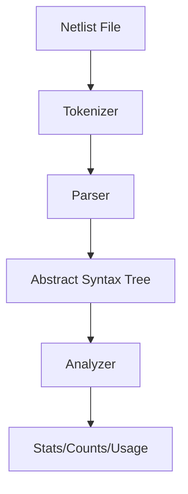

# Netlist Parser Architecture

This document outlines the internal architecture and design of the `netlist_parser` utility. The tool is designed to parse SPICE-like netlists (including CDL dialects), represent them in an Abstract Syntax Tree (AST), and perform static analysis such as flattening and component counting.

## 1. High-Level Architecture

The system is composed of three main layers:
1.  **Parser Layer**: Converts raw text into an AST.
2.  **AST Layer**: Strong Python object representation of the circuit.
3.  **Analyzer Layer**: Algorithms for inspecting, traversing, and flattening the AST.

## 2. Core Components

### 2.1 Parsing Engine (`netlist_parser/parser/`)

The parsing logic is separated into tokenization and semantic parsing.

*   **`SpiceTokenizer`**: 
    *   Handles line continuations (`+`).
    *   Strips comments:
        *   Standard SPICE: `*` at the start of a line.
        *   Inline comments: `$ ...` (CDL style), checking ensures valid parameters before `$` are kept.
    *   Yields "logical lines" for the parser to process.

*   **`SpiceParser`**:
    *   Implements the core parsing loop.
    *   **Scope Management**: Maintains a stack of scopes (Main Circuit -> Subckt -> Nested Subckt) to correctly place components.
    *   **Dialect Handling**:
        *   **Standard SPICE**: `Xname node1 ... subckt_name`
        *   **CDL**: `Xname node1 ... / subckt_name params...`. The parser specifically detects the `/` token to correctly identify the subcircuit name in CDL netlists.

### 2.2 Abstract Syntax Tree (`netlist_parser/ast.py`)

The AST is a hierarchy of Python dataclasses representing the circuit structure.

*   **`Circuit`**: The root object. Contains a list of global `Component`s, `Subckt` definitions, and `Model` definitions.
*   **`Subckt`**: Represents a `.SUBCKT` definition. Has `ports` (interface) and internal `components`.
*   **`Component`**: Abstract base class.
    *   **`SubcktInstance` (`X`)**: Represents an instantiation of a subcircuit. Stores `nodes` (connections) and `subckt_name` (reference).
    *   **`Mosfet` (`M`)**, **`Resistor` (`R`)**, **`Capacitor` (`C`)**, etc.: Primitive devices with specific attributes (nodes, value, model).

### 2.3 Analyzer (`netlist_parser/analyzer.py`)

The analyzer performs heavy lifting on the AST.

*   **`NetlistAnalyzer`**: The main interface for analysis.
*   **Top Cell Detection**:
    *   **Manual**: User supplies `--top-cell`.
    *   **Auto-detect (`find_top_cell`)**: Heuristic that looks for subcircuits that are *defined* but never *instantiated* by any other subcircuit.
*   **Flattening Engine (`flatten`)**:
    *   Recursively traverses `SubcktInstance` nodes.
    *   **Node Renaming**: Generates unique hierarchical names (e.g., `X1.X2.M1`) to resolve scope.
    *   **Node Mapping**: Maps internal subcircuit ports to parent nets.
    *   **Unresolved Handling**: If a subcircuit definition (e.g., standard cell) is missing (missing `.INCLUDE`), the analyzer tracks it in `unresolved_subckts` and treats the instance as a black box to prevent crashes.

## 3. Key Data Flows

### 3.1 flattening Algorithm
Flattening is essential for accurate transistor counts in hierarchical designs.

1.  Start at the **Root** (Top Cell).
2.  Iterate through components:
    *   If **Primitive** (M, R, C): Clone it, prefix its name with the current path (`path.name`), and add to the flat circuit.
    *   If **Instance** (X):
        1.  Look up the `Subckt` definition by name.
        2.  If not found -> Mark as **Unresolved** (Warning).
        3.  If found -> Create a **Port Map** (Subckt Port -> Instance Node).
        4.  Recursively call `flatten` on the Subckt's contents, passing the updated path (`path.instance_name`) and the Port Map.
        5.  Inside specific recursion: Internal nodes are prefixed; Ports are replaced by the parent's net name (from Port Map).

### 3.2 Model Usage Analysis
1.  Flatten the circuit first.
2.  Iterate through all primitives in the flat list.
3.  Accumulate counts of the `model` attribute (e.g., `nmos`, `pmos`).

## 4. Design Decisions & Trade-offs

*   **Custom Parser vs. Library**: A custom parser was chosen to support CDL-specific features (like `/` separators and `$` comments) that strict SPICE parsers often fail on.
*   **Static Analysis Focus**: The tool does not evaluate parameters (e.g., `W=1u+2u`) mathematically. It treats them as strings. This simplifies the architecture for the goal of connectivity and count analysis without needing a full SPICE simulation engine.
*   **Error Tolerance**: The decision to warn (and continue) on missing subcircuits rather than crash allows the tool to be useful on partial netlists or when standard cell libraries are not available.
